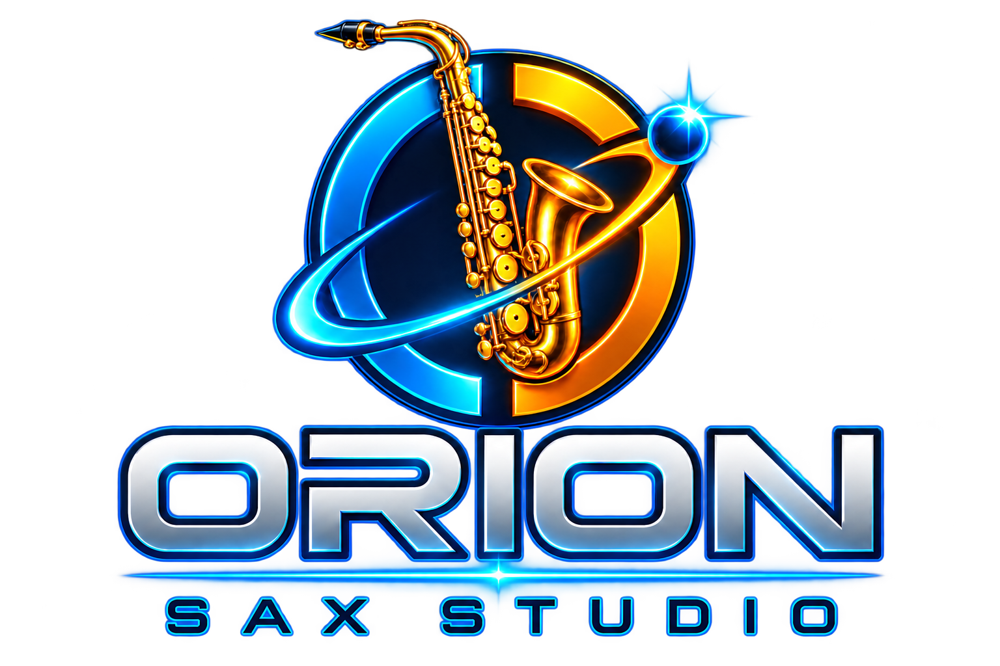
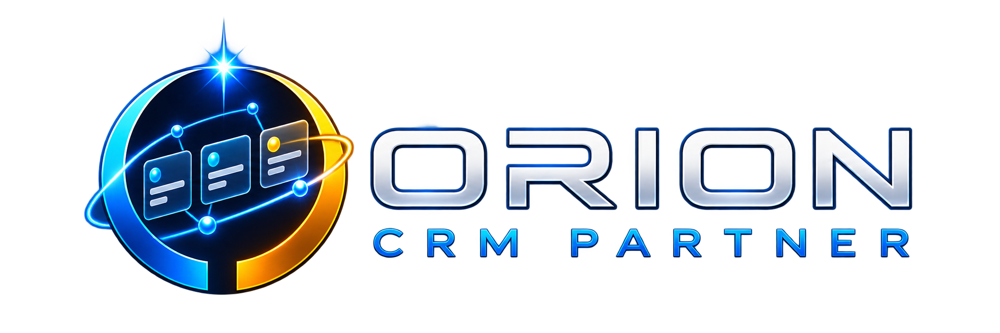
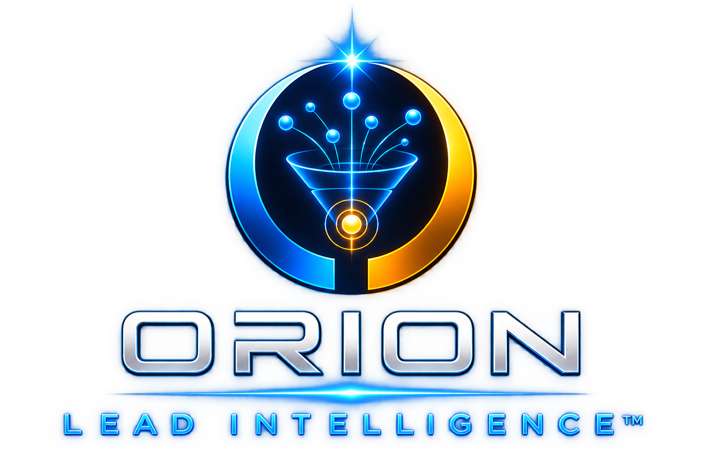
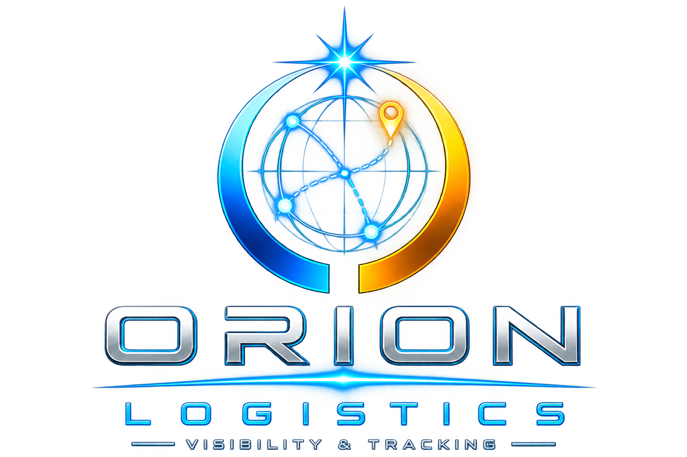

<p align="left">
<font size="6"><strong>👨‍💻 David Lima</strong></font>
</p>

<h3 align="left">
Project Manager | Product Builder | Dados & Inteligência Artificial
</h3>

<p align="left">
Profissional de tecnologia com sólida experiência em gestão de projetos, produtos digitais, transformação digital e liderança de equipes multidisciplinares.
</p>

<p align="left">
Atuo conectando estratégia, tecnologia, processos e pessoas para transformar desafios complexos em soluções executáveis. Atualmente, direciono minha evolução profissional para Dados e Inteligência Artificial, com foco em IA Generativa, LLMs, RAG, agentes de IA, automação e desenvolvimento de produtos inteligentes.
</p>

<p align="left">
🚀 Transformando estratégia em execução, dados em inteligência e ideias em produtos.
</p>

<br clear="both"/>

---

### 🌐 Conecte-se comigo

<p align="left">
<a href="https://www.linkedin.com/in/davidoliveiralima/" target="_blank">

</a>

<a href="https://www.instagram.com/orionintelligence.io" target="_blank">

</a>

<a href="https://www.instagram.com/davidolimaoficial/" target="_blank">

</a>

<a href="https://github.com/DavidOLimaOficial?tab=followers" target="_blank">

</a>
</p>

---

### 🧭 Gestão de Projetos e Produtos

<p align="left">


</p>

---

### 🤖 Inteligência Artificial

<p align="left">


</p>

---

### 🛠️ Ferramentas e Plataformas

<p align="left">

&nbsp;&nbsp;

&nbsp;&nbsp;

&nbsp;&nbsp;

&nbsp;&nbsp;

&nbsp;&nbsp;

&nbsp;&nbsp;

&nbsp;&nbsp;

</p>

<br/>

<p align="left">


</p>

---

### 🚀 Produtos e Aplicações

Soluções digitais desenvolvidas para transformar necessidades de negócio em produtos funcionais, combinando estratégia, gestão de produtos, tecnologia, automação e inteligência artificial.

#### ✅ Apps e Produtos em Produção

<table>
<tr>
<td width="100%" align="center" valign="top">
<br/>
<a href="https://voizy.app/" target="_blank">

</a>
<h2>Voizy.app</h2>
<p><strong>🎧 Tradução simultânea sem complicações para eventos</strong></p>
<p>O <a href="https://voizy.app/" target="_blank"><strong>Voizy.app</strong></a> simplifica a comunicação em conferências, palestras e eventos corporativos por meio de tradução em tempo real, com mais praticidade, acessibilidade e redução de custos.</p>
<p>A solução elimina a necessidade de cabines, equipamentos caros e estruturas complexas, permitindo que cada participante acompanhe o conteúdo traduzido diretamente em seu próprio dispositivo.</p>
<p>
✔️ <strong>Mais economia:</strong> reduz a necessidade de cabines e equipamentos caros<br/>
✔️ <strong>Alcance global:</strong> disponibiliza o evento em diferentes idiomas<br/>
✔️ <strong>Mais simplicidade:</strong> sem filas, downloads ou estruturas complexas<br/>
✔️ <strong>Mais acessibilidade:</strong> o público acompanha tudo pelo próprio dispositivo
</p>
<p><strong>Status:</strong> Produto em produção</p>
<p>
<a href="https://voizy.app/" target="_blank">

</a>
</p>
<br/>
</td>
</tr>
</table>

<br/>

#### 🧪 Produtos e Apps em Testes

##### 👤 Aplicações B2C

<table>
<tr>
<td width="50%" align="center" valign="top">
<br/>

<h3>Orion Movva</h3>
<p>Aplicativo inteligente para criação de treinos personalizados, acompanhamento da evolução física e gestão da rotina de exercícios.</p>
<p><strong>Status:</strong> MVP em testes</p>
<br/>
</td>
<td width="50%" align="center" valign="top">
<br/>

<h3>Orion Sax Studio</h3>
<p>Aplicativo para transposição de notas, organização de cifras e apoio à execução musical para saxofones e outros instrumentos de sopro.</p>
<p><strong>Status:</strong> MVP funcional em testes</p>
<br/>
</td>
</tr>
</table>

<br/>

##### 🏢 Aplicações B2B

<table>
<tr>
<td width="33%" align="center" valign="top">
<br/>

<h3>Orion CRM Partner</h3>
<p>Plataforma para gestão de leads, parceiros, indicações, oportunidades comerciais, pipeline e distribuição de comissões.</p>
<p><strong>Status:</strong> MVP em testes</p>
<br/>
</td>
<td width="33%" align="center" valign="top">
<br/>

<h3>Orion Lead Intelligence™</h3>
<p>Plataforma de inteligência comercial para análise, enriquecimento e priorização de leads com IA e integração planejada com a Econodata.</p>
<p><strong>Status:</strong> MVP em testes</p>
<br/>
</td>
<td width="33%" align="center" valign="top">
<br/>

<h3>Orion Logistics</h3>
<p>Plataforma para gestão de operações logísticas, motoristas, veículos, entregas, ocorrências, rastreamento e indicadores de desempenho.</p>
<p><strong>Status:</strong> MVP em testes</p>
<br/>
</td>
</tr>
</table>

<br/>

#### 🔍 Produtos e Apps em Discovery

<table>
<tr>
<td width="33%" align="center" valign="top">
<h3>📑 Orion Proposal Intelligence™</h3>
<p>Solução inteligente para geração de esboços de propostas comerciais a partir das necessidades, características e contexto de cada lead.</p>
<p><strong>Status:</strong> Discovery</p>
</td>
<td width="33%" align="center" valign="top">
<h3>👨‍⚖️ Orion Legal Intelligence™</h3>
<p>Plataforma de inteligência artificial para apoiar advogados e escritórios na análise de casos e elaboração de documentos jurídicos.</p>
<p><strong>Status:</strong> Discovery</p>
</td>
<td width="33%" align="center" valign="top">
<h3>🧠 Orion ERP Intelligence™</h3>
<p>Camada de inteligência artificial aplicada a ERPs para análise de dados, identificação de oportunidades, geração de alertas e apoio à decisão.</p>
<p><strong>Status:</strong> Discovery</p>
</td>
</tr>
</table>

---

### 🎯 Competências

- Planejamento e gestão de projetos de tecnologia
- Gestão de escopo, cronograma, riscos e dependências
- Liderança de squads e equipes multidisciplinares
- Gestão de produtos e construção de roadmaps
- Definição e acompanhamento de OKRs e indicadores
- Discovery, priorização e gestão de backlog
- Relacionamento com clientes e comunicação executiva
- Dimensionamento de projetos e elaboração de propostas
- Aplicação de IA Generativa na gestão de projetos
- Automação de processos com agentes de IA
- Modelagem de soluções utilizando LLMs, RAG e APIs
- Transformação de necessidades não estruturadas em planos executáveis

---

### 🚀 Áreas de interesse

```text
📊 Dados e Analytics
🤖 Inteligência Artificial Generativa
🧠 LLMs, RAG e agentes inteligentes
⚙️ Automação de processos
📱 Produtos digitais e aplicações Low Code
☁️ APIs, integrações e soluções em nuvem
🔭 Computação Quântica
```
